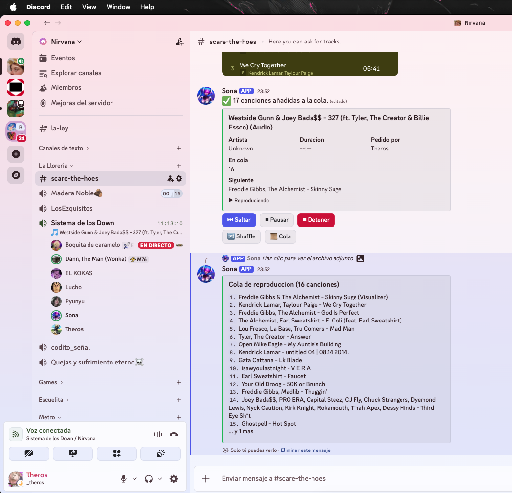

# 🎵 Spoty Scanner - Discord Music Bot

A Discord music bot that plays songs from Spotify links and searches. It intelligently matches YouTube videos, uses LLM-based tie-breaking, and optimizes API costs.

## ✨ Features

- **🎶 Spotify Integration** — Play individual tracks, entire albums, or playlists from Spotify URLs
- **🔍 Smart Search** — Heuristic-based ranking + LLM tie-breaking to find best YouTube matches
- **⚡ Optimized** — Search caching and limited LLM calls reduce API costs by 70%
- **📝 Dynamic Queue** — Queue tracks from albums/playlists, play first track immediately
- **🔊 Voice Channel Status** — Bot shows what's playing in Discord's voice channel status
- **🎯 Text Search** — Search by song/artist name with Spotify refinement



## 🚀 Quick Start

### 1. Setup (First Time)

```bash
./setup.sh
```

This guides you through:
- Getting Spotify credentials from [Spotify Developer Dashboard](https://developer.spotify.com/dashboard)
- Setting up environment variables

### 2. Run the Bot

```bash
./run.sh
```

This automatically:
- Creates/activates the Python virtual environment
- Installs dependencies
- Starts the bot

### 3. Use in Discord

1. Add the bot to your server (get invite from your bot page in Spotify Dashboard)
2. Join a voice channel
3. Use commands in the allowed text channel:

```
!play "artist - song name"         # Search and play
!play <spotify_url>                # Play from Spotify URL (track, album, or playlist)
!skip                              # Skip current song
!pause                             # Pause playback
!resume                            # Resume playback
!queue                             # Show queue
!np                                # Now playing
!stop                              # Stop and clear queue
!leave                             # Disconnect bot
```

## 🔧 Environment Setup

### Automatic (Recommended)
```bash
./setup.sh
```

### Manual
```bash
python3 -m venv venv
source venv/bin/activate
pip install -r requirements.txt

export BOT_TOKEN="your_discord_bot_token"
export SPOTIFY_CLIENT_ID="your_client_id"
export SPOTIFY_CLIENT_SECRET="your_client_secret"
export SPOTIFY_REDIRECT_URI="http://localhost:8888/callback"
export ALLOWED_CHANNEL_ID="discord_channel_id"
export VOICE_CHANNEL_ID="voice_channel_id"
```

## 📊 Optimizations

The bot includes 4 cost-reduction strategies:

1. **Search Cache** — Identical queries reuse cached YouTube results
2. **Increased LLM Margin** — LLM only called when candidates have <4.5 point spread (was 3.0)
3. **Limited LLM Tracks** — For albums/playlists, LLM only used on first 3 tracks
4. **Aggressive Heuristics** — Unwanted variants (live, remix, cover) score more harshly

**Result**: 10-track album: ~10 API calls → ~3 calls (70% reduction)

## 🎯 Settings

Edit these constants in `bot.py` to customize behavior:

```python
ALLOWED_CHANNEL_ID = 1163479541029810226  # Only this channel can use commands
VOICE_CHANNEL_ID = 1397428777876721716    # Connect to this voice channel on startup
MIN_SEARCH_SCORE = 6.0                    # Minimum quality threshold for YouTube matches
LLM_SCORE_MARGIN = 4.5                    # How close scores need to be for LLM tie-break
LLM_ENABLED_FOR_ALBUM_TRACKS = 3          # Use LLM for first N tracks in bulk operations
```

## 📁 Project Structure

```
spoty-scanner/
├── bot.py                    # Main Discord music bot
├── poc_setlistfm.py         # Setlist.fm playlist generator (legacy)
├── main.py                  # Artist discography generator (legacy)
├── requirements.txt         # Python dependencies
├── setup.sh                 # Auto-setup script
├── run.sh                   # Auto-run script
└── README.md               # This file
```

## 🔐 Getting Spotify Credentials

1. Go to [Spotify Developer Dashboard](https://developer.spotify.com/dashboard)
2. Sign in with your Spotify account
3. Create a new app
4. Copy **Client ID** and **Client Secret**
5. Add Redirect URI: `http://localhost:8888/callback`

## 🤖 Getting Discord Bot Token

1. Go to [Discord Developer Portal](https://discord.com/developers/applications)
2. Create a new application
3. Go to "Bot" tab → "Add Bot"
4. Copy the token (under "TOKEN")
5. Set `Privileged Gateway Intents`: Message Content Intent + Voice States Intent
6. In OAuth2 → URL Generator, select scopes: `bot` and permissions: `Send Messages`, `Connect to Voice`, `Speak`, `Use Voice Activity`

## ⚠️ Limits

- **YouTube throttling** — Stagger searches for large playlists (100+ tracks)
- **Spotify API** — Standard rate limits apply
- **LLM costs** — Reduced by 70% via optimizations, but still ~$0.01 per album with LLM enabled

## 🐛 Troubleshooting

| Issue | Solution |
|-------|----------|
| Bot won't start | Run `./setup.sh` to verify all credentials |
| Commands not working | Verify `ALLOWED_CHANNEL_ID` matches your Discord channel |
| No audio in voice | Check bot has "Speak" permission in voice channel |
| YouTube search failing | Bot will fall back to searching for each track individually |
| "No reliable candidate" warning | Lower `MIN_SEARCH_SCORE` or check if track exists on YouTube |

## 📝 License

MIT License — Feel free to use and modify.

---

**Now playing: Your Spotify library on Discord! 🎶**
